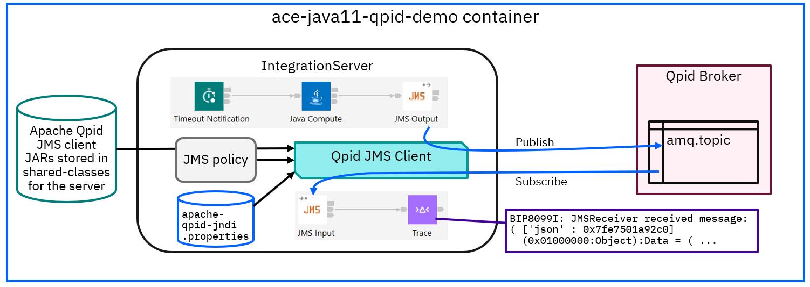

# ace-java11-qpid-demo
Demo of ACE using Apache Qpid and Java11 originally written to accompany a [blog post](https://community.ibm.com/community/user/integration/blogs/trevor-dolby/2023/10/24/ace-v12-with-java11-and-apache-qpid-jms).

This repo contains applications and infrastructure to demonstrate ACE flows using Apache Qpid JMS client JARs that do not 
work with Java8 and require the new ACE v12 Java11 support. To make the demo simpler, the Qpid broker is installed and
run in the same container and the flows are written to run on a timer:



The container starts up as follows:
- Start the Qpid broker in the background
- Pull the initial guest password from the Qpid config and use mqsisetdbparms to create the JMS credentials
- Start the IntegrationServer, which should run successfully as long as Java11 is used

## Building the container

This demo is designed to work with most ACE containers as a base, including
- The IBM-provided ACE container from [ot4i/ace-docker](https://github.com/ot4i/ace-docker) (the default).
  Note that this requires an IBM entitlement key if pulling the pre-built images from cp.icr.io, but could
  also be built locally from source using the Dockerfile in the repo.
- The ace-basic image from the [experimental](https://github.com/trevor-dolby-at-ibm-com/ace-docker/tree/main/experimental)
  directory. Must be built locally.
- An ace-minimal image using Java11 as the default for the whole installation, also from the
  [experimental](https://github.com/trevor-dolby-at-ibm-com/ace-docker/tree/main/experimental) directory.
  Must be built locally.

Assuming the default of the pre-built ACE container, the build process is
```
docker build --build-arg LICENSE=accept -t ace-java11-qpid-demo .
```
which will do the following:
- Install prereqs such as `tar` and `which`.
- Download and unpack the Apache Qpid broker and JMS client JARs.
- Build the JMS applications and run unit tests, installing the validated applications in the work directory.
- Change the JRE to Java11 using `ibmint specify jre` on the work directory.
- Copy in the JNDI properties needed for the JMS client to find the broker.
- Set the startup command to start the Qpid broker, create credentials, and start the IntegrationServer.

## Running the container

Run the container as follows:
```
docker run -e LICENSE=accept --rm -ti  ace-java11-qpid-demo
```
and the console should print out the startup sequence followed by messages being sent every few seconds 
between the two flows using JMS:
```

2023-10-25 02:19:27.553     42 SLF4J: Defaulting to no-operation (NOP) logger implementation
2023-10-25 02:19:27.553     42 SLF4J: See http://www.slf4j.org/codes.html#StaticLoggerBinder for further details.
2023-10-25 02:19:27.597468: BIP4669W: JMSClient.'Message FlowGetFlow'. A backout destination was not configured for a JMS node.
2023-10-25 02:19:28.374720: BIP4649I: A connection with the JMS provider has been made on behalf of node ComIbmJMSClientInputNode using initial context factory org.apache.qpid.jms.jndi.JmsInitialContextFactory, JNDI bindings location /tmp/apache-qpid-jndi.properties and connection factory name demoCF. This connection is using the JMS transaction mode None.
2023-10-25 02:19:28.374920: BIP4649I: A connection with the JMS provider has been made on behalf of node ComIbmJMSClientOutputNode using initial context factory org.apache.qpid.jms.jndi.JmsInitialContextFactory, JNDI bindings location /tmp/apache-qpid-jndi.properties and connection factory name demoCF. This connection is using the JMS transaction mode None.
2023-10-25 02:19:32.578     44 ========= JMSSender sending a message to a topic ========

2023-10-25 02:19:32.621948: BIP8099I: JMSReceiver received message:
( ['json' : 0x7fb7c43a1660]
  (0x01000000:Object):Data = (
    (0x03000000:NameValue):hello = 'world' (CHARACTER)
  )
)
: GetFlow.Trace  -  {2}
```

## Java8 

This demo is designed to use Java11, but can be modified to run with Java8 by commenting out the
lines in the Dockerfile that enable Java11
```
RUN bash -c "export LICENSE=${LICENSE} ; . /opt/ibm/ace-12/server/bin/mqsiprofile ; \
    ibmint specify jre --version 11 --work-dir /home/aceuser/ace-server"
```
and after the container has been rebuilt, the server will start but fail to use the JMS drivers:
```
2023-10-25 02:22:00.513154: BIP2628W: Exception condition detected on input node 'GetFlow.JMS Input'.
2023-10-25 02:22:00.513309: BIP4367E: The method 'run' in Java node 'JMS Input' has thrown the following exception: java.lang.UnsupportedClassVersionError: JVMCFRE199E bad major version 55.0 of class=org/apache/qpid/jms/jndi/JmsInitialContextFactory, the maximum supported major version is 52.0; offset=6.
2023-10-25 02:22:00.513353: BIP4395E: Java exception: 'java.lang.UnsupportedClassVersionError'; thrown from class name: 'java.lang.ClassLoader', method name: 'defineClassInternal', file: 'ClassLoader.java', line: '397'
2023-10-25 02:22:00.513391: BIP4367E: The method 'defineClassInternal' in Java node 'unknown' has thrown the following exception: java.lang.UnsupportedClassVersionError: JVMCFRE199E bad major version 55.0 of class=org/apache/qpid/jms/jndi/JmsInitialContextFactory, the maximum supported major version is 52.0; offset=6
java.lang.ClassLoader.defineClassInternal(ClassLoader.java:397)
java.lang.ClassLoader.defineClass(ClassLoader.java:358)
java.security.SecureClassLoader.defineClass(SecureClassLoader.java:154)
java.net.URLClassLoader.defineClass(URLClassLoader.java:730)
java.net.URLClassLoader.access$400(URLClassLoader.java:96)
java.net.URLClassLoader$ClassFinder.run(URLClassLoader.java:1187)
java.security.AccessController.doPrivileged(AccessController.java:782)
java.net.URLClassLoader.findClass(URLClassLoader.java:605)
com.ibm.broker.classloading.JavaResourceClassLoader.findClass(JavaResourceClassLoader.java:180)
com.ibm.broker.classloading.SharedClassLoader.findClass(SharedClassLoader.java:230)
java.lang.ClassLoader.loadClassHelper(ClassLoader.java:948)
java.lang.ClassLoader.loadClass(ClassLoader.java:893)
java.lang.ClassLoader.loadClass(ClassLoader.java:876)
com.ibm.broker.classloading.JavaResourceClassLoader.loadClass(JavaResourceClassLoader.java:579)
com.ibm.broker.classloading.SharedClassLoader.loadClass(SharedClassLoader.java:238)
java.lang.Class.forNameImpl(Native Method)
java.lang.Class.forName(Class.java:424)
com.sun.naming.internal.VersionHelper12.loadClass(VersionHelper12.java:103)
com.sun.naming.internal.VersionHelper12.loadClass(VersionHelper12.java:113)
com.sun.naming.internal.VersionHelper12.loadClass(VersionHelper12.java:73)
javax.naming.spi.NamingManager.getInitialContext(NamingManager.java:693)
javax.naming.InitialContext.getDefaultInitCtx(InitialContext.java:324)
javax.naming.InitialContext.init(InitialContext.java:255)
javax.naming.InitialContext.<init>(InitialContext.java:227)
javax.naming.directory.InitialDirContext.<init>(InitialDirContext.java:112)
com.ibm.broker.jmsclienthelper.JMSClientHelper.setInitialContext(JMSClientHelper.java:845)
com.ibm.broker.jmsclienthelper.JMSClientInputReplyHelper.getJMSInput(JMSClientInputReplyHelper.java:291)
com.ibm.broker.jmsclientnodes.JMSClientInputNode.run(JMSClientInputNode.java:439).
```
